# IBM i operating system

This is intended to give a guideline on the eternal IBM i operating system.


## Table of contents

- [Abstractions](#abstractions)
  - [Starting from the bottom](#starting-from-the-bottom)
  - [Toward Higher-Level Abstraction](#toward-higher-levels)
  - [The System/38](#the-system38)
- [The legendary AS/400](#the-legendary-as400)
  - [Inside the 400](#inside-the-400)
- [The IBM I](#the-ibm-i)
  - [Explaining Objects](#explaining-objects)
  - [IBM I Object system, not File system](#ibm-i-object-system-not-file-system)
  - [Program execution (and Resource allocation?)](#program-execution-and-resource-allocation)
  - [Resource allocation](#resource-allocation)
- [Getting the tools](#getting-the-tools)
- [Facing the IBM I](#facing-the-ibm-i)
- [IBM Highlights](#ibm-highlights)
- [The end](#the-end)

# Abstractions

The special term in computer science is **abstraction**. There are levels of abstraction, basically from the atom to the internet. 

## Starting from the bottom

We are going to start from the silicon up to get a better understanding of what is going on behind the green screen.

Silicon has some nice properties to make transistors. With transistors, you make logical gates; these logical gates perform boolean operations, which turn into logical units that form a circuit, and in the middle we have the CPU, which has its corresponding architecture and instruction set architecture. 

We are familiar with the [*x86-64*](https://en.wikipedia.org/wiki/X86-64) archs. Currently, IBM has the [*PPC64*](https://en.wikipedia.org/wiki/Ppc64) processor architecture with the [*Power ISA*](https://en.wikipedia.org/wiki/Power_ISA) instruction set architecture which is a [*RISC*](https://en.wikipedia.org/wiki/Reduced_instruction_set_computer) instruction set (yeah, RISC like [RISC-V](https://en.wikipedia.org/wiki/RISC-V])) and the latest chip model is the [Power10](https://en.wikipedia.org/wiki/Power10).

IBM made the first leap from the early designs of cumputers from [Harvard architecture](https://en.wikipedia.org/wiki/Harvard_architecture) to the [Von Neuman](https://en.wikipedia.org/wiki/Von_Neumann_architecture) single-operator machine: instruction and data shared the same memory, they were fetched, decoded, and executed in a linear fashion, no branch prediction or fancy stuff. This was the [IBM 701](https://en.wikipedia.org/wiki/IBM_701). 

Programs were written in low-level languages, which made them tightly coupled to the hardware. That means: *if you change the hardware, the software breaks and if you change the software without updating the hardware, it just doesn't work anymore*

## Toward Higher-Levels

Due to the increase in complexity and requirements, the limitations of low-level programming became evident. That's when higher-level languages like [Fortran](https://en.wikipedia.org/wiki/Fortran), [COBOL](https://en.wikipedia.org/wiki/IBM_COBOL) and [RPG](https://en.wikipedia.org/wiki/IBM_RPG) came into play. The [compiler](https://en.wikipedia.org/wiki/Compiler) translated these high-level languages to machine-specific instructions. 

Now we had an intermediary layer: the [*compiler*](https://en.wikipedia.org/wiki/Compiler). But here is the important part: **the compiled code still executed directly on the processor’s native instruction set**. If you change the CPU architecture or instruction set, all compiled programs just break. 

The same goes for storage, it was not possible to increase it dynamically without changes to the machine and the software running on it.

> Big companies running 24/7 operations would not be too happy about changing all their software to update the hardware.

There was a need for a better way to manage resources independently, improve them and scale. For a machine, there are basically 2 important parts: **Computation** and **Storage**. IBM knew this very well and decided that to really improve the technology, they needed to separate these two and **abstract** them to the high-level implementations with an intermediary layer.

To **abstract Storage**, a single representation of all the system storage was needed. The idea of [Single-level storage (SLS)](https://en.wikipedia.org/wiki/Single-level_store) started emerging with the *HLS* (Higher Level System), and the [Future Systems project (FS)](https://en.wikipedia.org/wiki/IBM_Future_Systems_project). 

To **abstract Computation**, a machine that *natively* executed high-level procedural languages ([FORTRAN](https://en.wikipedia.org/wiki/Fortran), [COBOL](https://en.wikipedia.org/wiki/COBOL), [PL/i](https://en.wikipedia.org/wiki/PL/I), [APL](https://en.wikipedia.org/wiki/APL_(programming_language)), [RPG](https://en.wikipedia.org/wiki/IBM_RPG)) was needed, but without interpretation downtime (like the [Java virtual machine (JVM)](https://en.wikipedia.org/wiki/Java_virtual_machine)).

If that is not enough, this new system also needed to be backwards compatible with previous older systems.

This movement towards a unified IBM product line was called [***Project Fort Knox***](https://en.wikipedia.org/wiki/IBM_AS/400#Fort_Knox). Needless to say, this was an incredibly ambitious project that needed a large number of breakthroughs in many areas at the time, which led to the ***Project Fort Knox*** being terminated. 

> Actually, ***Project Fort Knox*** was one of IBM top most time/resource consuming projects.

The seed of these ideas set a firm base for the future of IBM and paved the way for the new generation of machines: The **System/38**.

## The System/38

The [System/38](https://en.wikipedia.org/wiki/IBM_System/38) was released. It actually had some of the original ambitious ideas of ***Project Fort Knox***.

Programs were compiled into a high-level instruction set, which was not *interpreted* but rather *translated* into a lower-level machine instruction set to be executed (big emphasis on *translated*). This was done through a **Machine Interface (MI)**, the high-level architecture is never directly executed, or put in other words: **the hardware and the software can be improved independently**. (**Computation abstraction**)

> The operating system for the System/38 was the [Control Program Facility](https://en.wikipedia.org/wiki/Control_Program_Facility). Before that IBM had the [System Support Program](https://en.wikipedia.org/wiki/System_Support_Program) operating system for the [System/34](https://en.wikipedia.org/wiki/IBM_System/34) and the [System/36](https://en.wikipedia.org/wiki/IBM_System/36). These were actually considered midrange computers, small mainframes.

The system implemented the [Single-level storage (SLS)](https://en.wikipedia.org/wiki/Single-level_store) where all addressable objects and segments are directly accessible in virtual memory with no concept of secondary storage. (**Storage abstraction**). This Single-level abstraction gave raise to the conpcet of ***Object***.

## Explaining Objects

An **object** is an instance of an abstract data type and the system high-level  instructions exist to create, manipulate, examine and delete each of these system object types. The data type of the object defines what type of operations can be performed on it. That is the technical definition and is leveraging on the ideas of **Computation abstraction** and **Storage abstraction**. 

> The non technical definition: An object is *something* to *operate on*.

> This idea is similar to typed pointers in a programming language like C: `int *i = 0` => This means that at some address the machine will store a series of bits that will be interpreted in the context of the abstract data type **int**.

These high-level instructions are encpauslated in the [CL (Control language)](https://en.wikipedia.org/wiki/Control_Language) commands which is designed to mainupalate these **objects**

When a **CL** command that modifies an object is executed, it actually performs a series of memory-to-memory high-level microcode instructions that modify the object attributes or composition directly, instead of doing register-to-memory operations like low-level instructions set.

**Objects** can be: programs, jobs, tables, cursors, data queues, memory spaces, etc. The memory space is the only object that can be manipulated at the byte level by instructions like the legendary ***MOVE*** operation.

> As you may see, IBM took the idea of abstract data type like int, float, char, etc, to a whole new level.

> A job or process has a ***Process Control Space*** object that contains its state and is usually asiciated to a ***User Profile*** object when you log in on the system.

To address (locate) these **objects**, the system uses different types of pointers: system pointers, space pointers, data pointers, instruction pointers, etc.

Pointers address objects but they use a ***context object*** (**Library** on the IBM I) to resolve names which allow logical object substitution (which are zero cost movements, similar to those performed on tensor tranformations like transpose). The same object name can reffer to different object in different context. When an object is addressed, the system examines the ***Name Resulition List (NRL)*** (**Library list** on the IBM I) which is basically a list of pointers to various ***context objects*** 

The consequences of these *abstraction* ideas were huge: separation of high-level programming from specific instruction sets, *translation* of high-level instructions to low-level for no *interpretation* downtime, single-level-storage where programs, files and everything else were treated as objects in the same address space, and finally, a built-in database (not relational yet) (DB2 Intro coming soon). Sounds like a W.

>The idea of modularization and separations at different levels of abstraction is a pattern found on many areas of computer science. Some examples: the network stack ([OSI Model](https://en.wikipedia.org/wiki/OSI_model), [TCP/IP](https://en.wikipedia.org/wiki/Internet_protocol_suite) ) and the internet ([REST arch](https://en.wikipedia.org/wiki/REST)).

## The legendary AS/400

After ***Project Fort Knox*** being terminated [***Project Silverlake***](https://en.wikipedia.org/wiki/IBM_AS/400#Silverlake) begun. 

Built on the [System/38](https://en.wikipedia.org/wiki/IBM_System/38)'s architecture and after refining and extending its concepts, ***Project Silverlake*** gave life to the famous [AS/400](https://en.wikipedia.org/wiki/IBM_AS/400). Which was one of IBM’s most successful midrange systems due to its robustness, flexibility, and backward compatibility.

This system marked a revolutionary step in IBM architecture by re-introducing the high-level *machine interface* (MI) with the concept of a [Technology Independent Machine Interface (TIMI)](https://en.wikipedia.org/wiki/IBM_i#TIMI). This is like a virtual machine and the reason behind the [Integrated Language Environment (ILE)](https://en.wikipedia.org/wiki/Integrated_Language_Environment) (More about ILE on my RPG repo coming soon)

> This machine interfaced allowed IBM to move the AS/400 from the 48­bit CISC (IMPI) original implementation to the 64­bit RISC (PowerPC) processor architecture without needing to change the hadrware independent layer.

The **Single-level storage (SLS)** of the **System/38** was also implemented to give a single virtual abastraction of all the system resources to the **AS/400**.

> The system keeps track of the virtual memory segments by doing a hashing XOR on the segment unique id bits to create an index and store it in a hashing table. (Other systems do the same). There is another table that maps these virtual addresses to primary memory. If the maping of a virtual page is not found in the primary memory, then it is loaded from secondary storage: That's called ***Pagination***. Since the addresses of virtual memory can be very large, there is no problem of overlapping.

Again, leveraging on these two concpets of **Computation and Resource** abstractions, is the concept of ***Object*** as it was in the **system/38**

The **TIMI** virual interface is supported by the ***System Licensed Internal Code (SLIC)***, written in [C++](https://en.wikipedia.org/wiki/C%2B%2B) and assembler. The **SLIC** can be compared to a [Kernel](https://en.wikipedia.org/wiki/Kernel_(operating_system))

The **SLIC** supports the **TIMI** wich inturn is the base of the **XPF** which is the code that implements the hardware independent components of the operating system that are compiled into **TIMI** instructions. Is is implemented in PL/MI

The operating system of this machine was the Integrated Operating System (OS/400). Later, the AS/400 evolved into the iSeries, System I and now [IBM Power Systems](https://en.wikipedia.org/wiki/IBM_Power_Systems). The OS/400 was renamed to i5/OS and then to the [IBM i](https://en.wikipedia.org/wiki/IBM_i). 

> IBM likes to change names a lot.

# Finally, The IBM I

With the release of IBM POWER 6 systems, IBM finally finished the merge of the System I and [System p](https://en.wikipedia.org/wiki/IBM_System_p) hardware. Today it is possible to run [IBM i](https://en.wikipedia.org/wiki/IBM_i), [AIX](https://en.wikipedia.org/wiki/IBM_AIX) and [Linux](https://en.wikipedia.org/wiki/Linux) on the IBM POWER systems. 

> This layout: **IBM I/AIX** is what you usually see in most companies nowadays and is mostly taken for granted.

> POWER stands for: Performance Optimized With Enhanced RISC

The man behind this merge was [Frank Soltis](https://en.wikipedia.org/wiki/Frank_Soltis)

The [XPF](https://en.wikipedia.org/wiki/IBM_i#XPF) layer supports the [IBM I Operating system](https://en.wikipedia.org/wiki/IBM_i), which is actually the topic of this repo. Here starts the IBM I guideline.

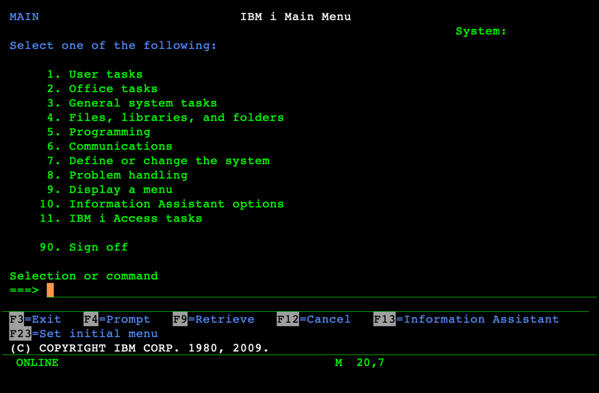


Some recap, a ***context object*** is the object **Library** and the ***Name Resulition List (NRL)*** is the **Library list** of the job which has a list of libraries where objects will be searched. This will make more sense later.

> The library list control how the system accesses objects

> Extra: Since everything is an object on the IBM I, you can have security at the object level. Which means that the pointer addressing the object is first checked to be autorized or rejected to perform the operations. That is really nice.

## Object system, not File system

The purpose of a file system is to abstract files, since the system already abstracts everything (including files) as objects, why should it need a file system? Well, IBM thougth the same. 

In this way, the IBM I has no need of a traditional file system. It uses an object system.

**Objests** are data and description of that data (meta-data) that defines how it can be interacted with and manipulated. 

To really understand 
The IBM I object system has two interesting objects that you need to know about: **Libraries** and **Source PF(Physical File)** which are not the same as a **PF(Physical File)**. Stay with me. I'll explain.

A Physical File is the IBM I native version of an SQL table, intended for storing data to be processed. A ***Source PF*** is a kind of table used to store the source or **description** of other objects to be compiled o created. 

> Remember that the IBM I has an integrated relational database implementend at the machine level (**SLIC**). ***Source PF***, **PF(Physical File)** and **SQL Tables** are managed by this engine called **DB2**

A ***Source PF*** is a **multi-member** table. What does this mean? For a SQL table you usually define the columns with their data type, this defines a register and thus the whole table. A **multi-member** ***Source PF*** table can have more than one register definition (it is the same definition multiple times). Each member or definition stores the source-code/definition of a program, table and other object. 

> This  **multi-member** idea is a weird concept that does not exist in any other operating system, so don't get too hung up on it if you can't grasp it right now.

A **library** is used to group, contextualized and locate objects independently of where they are stored (a library is similar to a folder, not quiet though). It can sttore compiled programs (**PGM**, **MODULE**, **SRVPGM**, etc), tables (**FILE: PF-DTA**, **FILE: PF-SRC**, **FILE: DSPF**, etc) and other objects.

## Program execution

A program object is basically a stream of instructions with some definition and user data. Can be seen as a compiled unit of execution.

There are two points to a program execution: **Activation** and **Invocation**

**Activation** Causes static storage for the program to be allocated and initialized: Gloabal variables and files are made addressable (This is usually the **data** or **static** segment of memory. Check [Address space](https://en.wikipedia.org/wiki/Address_space)).

**Invocation** Occurs when there is a transfer of control to the program. At invocation time, dynamic storage is allocated (Usually in the **heap** memory segment. Check [Address space](https://en.wikipedia.org/wiki/Address_space)) 

A process data structure contains an activation entry for each activated program in the job. Each invocation entry contains status information, a pointer to the previous invocation entry, a pointer to the program instructions and the automatic storage. After the invocation entry is allocated and initialized, control is transfer to the program at its ***entry point*** (also called ***PEP**)

> **Activation** can be done explicity or implicit. If a **CALL** is made to a program that has not been activated, the hardware automatically does the activation and then the invocation.

## Resource allocation

The main purpose of an operating sytem is managing resources (CPU, Disk, Memory, etc); this includes abstracting and assigning them where needed.

To execute a program, the OS needs to allocate the resources needed for it, but it does not allocate them directly to the program; rather, an abstraction is used: [**The job**](https://en.wikipedia.org/wiki/Job_(computing)). This is the **Activation**.

The system allocates resources to the job, and the program is basically **loaded** (**activated**) into the job resources. Now the program can be executed (**invocated**) through the job resources. Really cool stuff.

**A job can be viewed as a unit of abstracted system resources**(computation and storage). By itself it can't do much since there is nothing to do. The same applies to a program in an inverse manner; by itself is no more than a series of instructions and data stored in disk without being used. But when the program data (instructions and data) are loaded into the corresponding job memory segment and the jobs resources are allocated for executing the program, then job/program execution interaction creates what is called a **process**. 

> During a process execution, the instructions and data will be loaded from memory into the registers to be executed by the processor. Modern operating systems fetch a large number of instructions, generate a dependency graph and try to execute them in a parallel and out-of-order manner. Every time you run a program, it never runs the same way twice, even though it gives the same result. That's kind of amazing.

On the IBM I, a job can have many activations, which are managed in groups called **activation groups**, pretty straightforward. This means a job can have many activation groups. The resources on these groups include programs, tables, devices, and any other resource/objects the programs to be **invoked** may need. The job sees them all as part of the same virtual memory (thanks to **Single-level storage (SLS)** from way back). 

To liberate the job resources, the system only needs to to delete the activation group, which, effectively, is a **deactivation**.

We know that the IBM I allocates resources for a program in a job, but how does it allocates the resources for the job itself? That's where the **subsystems** come into play.

A subsystem is similar to a job in the sense that it is an abstraction of the system resources (hence the name sub-system, like a part of the full system), but instead of its resources being used to **activate** and **invoke** programs, it is used to spawn jobs. 

# Hands-on

Enough explanations, ideas by themselves are nothing unless you are some Hellenistic Greek philosopher. We need to apply them to generate knowledge, that's the beauty of engineering: it works, or it does not work. Let's prepare for some hands-on. 

## Getting the tools

To use the IBM I, access to a Power server is necessary. We'll be using [PUB400](https://pub400.com/) which is a Power server on the internet. Head to the [sing up](https://pub400.com/cgi/signup.nd/start) page and create your user.

After that you need a way to **connect** to it, we'll be using the [ACS (Access Client Solutions)](https://www.ibm.com/support/pages/ibm-i-access-client-solutions) which is free. It emulates a [5250 terminal](https://en.wikipedia.org/wiki/IBM_5250) (the green scren) over telnet.

We also need a modern way to edit code. [VsCode](https://code.visualstudio.com/) with the [IBM I Development Pack](https://marketplace.visualstudio.com/items?itemName=HalcyonTechLtd.ibm-i-development-pack) through [Code4i](https://marketplace.visualstudio.com/items?itemName=HalcyonTechLtd.code-for-ibmi) is the way.

You can check this nice [tutorial by Marco](https://github.com/MarcoDeSenas/IBMi-topics-thanks-to-pub400/blob/main/HowTo/Workstation%20tools.md) that describes the three previous steps.

At this point, you should have the background necessary to tackle the IBM i.
 
## Facing the IBM I

Once inside, we see the iconic green screen. What is this? Well, it is a terminal, like the [Windows CMD](https://en.wikipedia.org/wiki/Cmd.exe) or the Linux [bash shell](https://en.wikipedia.org/wiki/Bash_(Unix_shell)). 

What is the purpose? To send commands to the operating system like any other shell. The IBM I shell is called **QCMD**, you can actually do a ***CALL QCMD*** to directly invoke the terminal.

> A **CALL** returns a system pointer that allows the program to be called.

These commands are called the **Control Language (CL)**(remember?). It provides a consistent interface to all system functions (user-written commands can also be created). This language provides rich function and a consistent set of terminology and syntax. Most commands can be executed interactively (***F4***, you'll see it later) or from a high-level language program (***SYSTEM*** API). 

> You can even create CL programs, which allow the use of variables, error handling and access to the database. Programming functions include reading and writing to a database file, IF/THEN/ELSE logic, calling or being called from another program, etc.

IBM I has a utility for navigation called [***PDM (Programming Development Manager)***](https://en.wikipedia.org/wiki/Programming_Development_Manager). PDM is invoked with ***STRPDM***

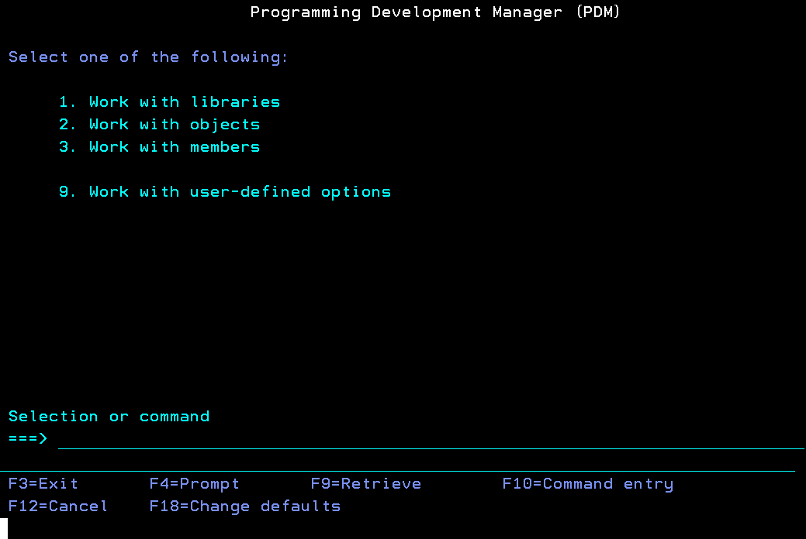

There you can select an option to work with libraries, objects or members. But you can also execute the commands directly like this:

* work with libraries: ***wrklibpdm*** + ***F4***
* work with objects: ***wrkobjpdm*** + ***F4***
* work with members: ***wrkmbrpdm*** + ***F4***

> As i told you, almost all IBM I commands can be prompted with **F4**, this will show you the minimum parameters required to execute them. Some commands have extra parameters that can be viewed with **F10** and to change the presentation of the parameters press **F11**

These **PDM** commands are the basics for navigating the IBM I when you are starting.

Inside PUB400 you should have two libaries with the name of your user plus a 1 and a 2 like this

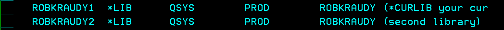

Go to your library with ***wrklibpdm yourlib1***, select option ***12***

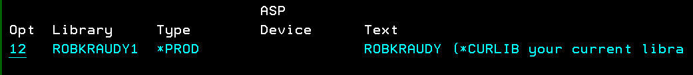

Your library is probably empty. We will create a compiled object, a program, to demostrate some of the explained concepts. 

A *source PF* is needed for the source code of the program, lets create it. You can do ***F6*** + ***OPT 153*** from *PDM* or execute the command directly ***CRTSRCPF*** + ***F4***

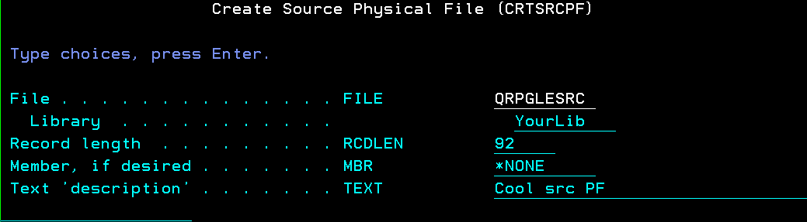

Press ***F5*** to refresh and the new source PF should be in your library

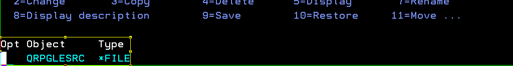

> Hit ***Shift*** + ***F11*** if youn can't see the ***OPT 12***

Do ***OPT 12*** on the source PF. 

Once inside the source PF, you can do ***F6*** directly to create a new source PF member. This member is an [RPGLE](https://en.wikipedia.org/wiki/IBM_RPG) source code called **HELLO**.

> Aside from the RPG programming language you can also use other languages like [COBOL](https://en.wikipedia.org/wiki/COBOL#:~:text=COBOL%20(%2F%CB%88ko%CA%8Ab,2002%2C%20object%2Doriented%20language.)), [C](https://en.wikipedia.org/wiki/C_(programming_language)) and [C ++](https://en.wikipedia.org/wiki/C%2B%2B).

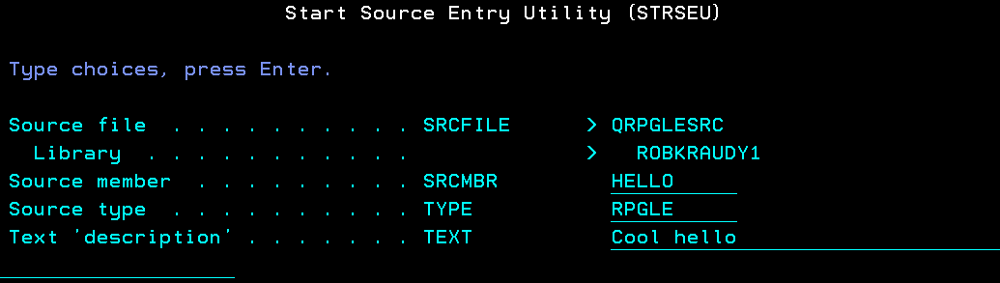

You should see something like this

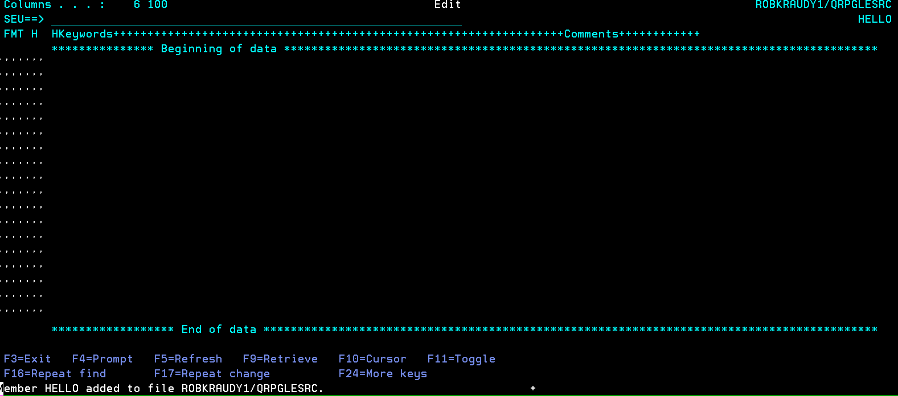

Don't panic!. This is the original way of doing things. Later I'll show how to use modern tools. But it is important for you to know about the green screen. Why? you may ask, well: *It always works*

That is the IBM [SEU](https://www.nicklitten.com/course/what-is-seu-source-entry-utility/). It was the original *IDE* of the IBM I developers. Here just press ***enter*** + ***F10*** and add the word **FILE** in the upper line, press ***enter*** again and you should have the new member.

> Believe it or not, i have seen programmers in the wild still using SEU.


Now we are going to use VsCode to edit it. Here you have the [Code for IBM i Docs](https://codefori.github.io/docs/quickstart/).

Go to your library in the Code4i Object Browser and open the hello source in the qrpglesrc member

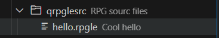

Add this rpgle code to the member

I have another repo (RPG Intro here) if you want to really understand this code.

```rpg
**free
Ctl-opt DftActGrp(*No);
Dsply 'Hello world!, edited';
*inlr = *on;
return;
```
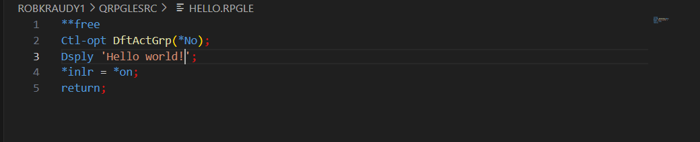

Just save it and now we'll compile it the old fashion way.

Do ***OPT 14 (compile) + F4*** on the **HELLO** source member. 

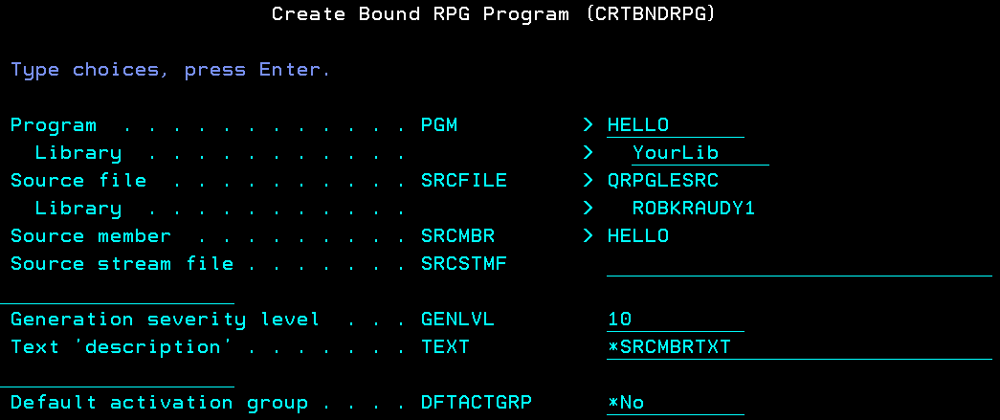

> This option executed the following CL (Control lanaguage) command directly **CRTBNDRPG PGM(YOURLIB/HELLO) SRCFILE(YOURLIB/QRPGLESRC) SRCMBR(HELLO) DFTACTGRP(*NO) REPLACE(*YES)**

You should see the compiled object in your library


Do ***OPT 16 (run)*** on the **HELLO** pgm. The output should be like this.

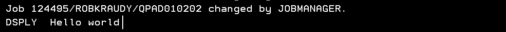

It is also possible to create the member, edit the source code and compile it directly from the Code4i VsCode plugin with some other modern techniques. For that check my [RPGLE intro]() or the [IBM I pipeline](https://github.com/kraudy/IBM-i-pipeline)

## IBM Highlights

* Single Integrated Operating System for all models
* Investment Protection
* Client/Server Support
* Integrated DB2 Relational Database
* Transaction Processing
* Batch Processing
* Ease of Installation, Use, and Maintenance
* Extensive Run-time Application Function
* Productive Application Development Environment
* Integrated Language Environment (ILE)
* Enabling Technologies
* Openness
* High System Availability
* Comprehensive Security for System Resources
* Interfaces to System Functions
* Multiple Operating Environments
* Connectivity to Remote Devices, Systems and Networks

***Openness*** is my favorite one. This has been a core IBM value for a long time, what happens is that people usually don't know about it.

## The end

That's it. It was a long run, hope you find it useful.

If you have any suggestions open an issue and i'll check it out.

Thanks for reading.
