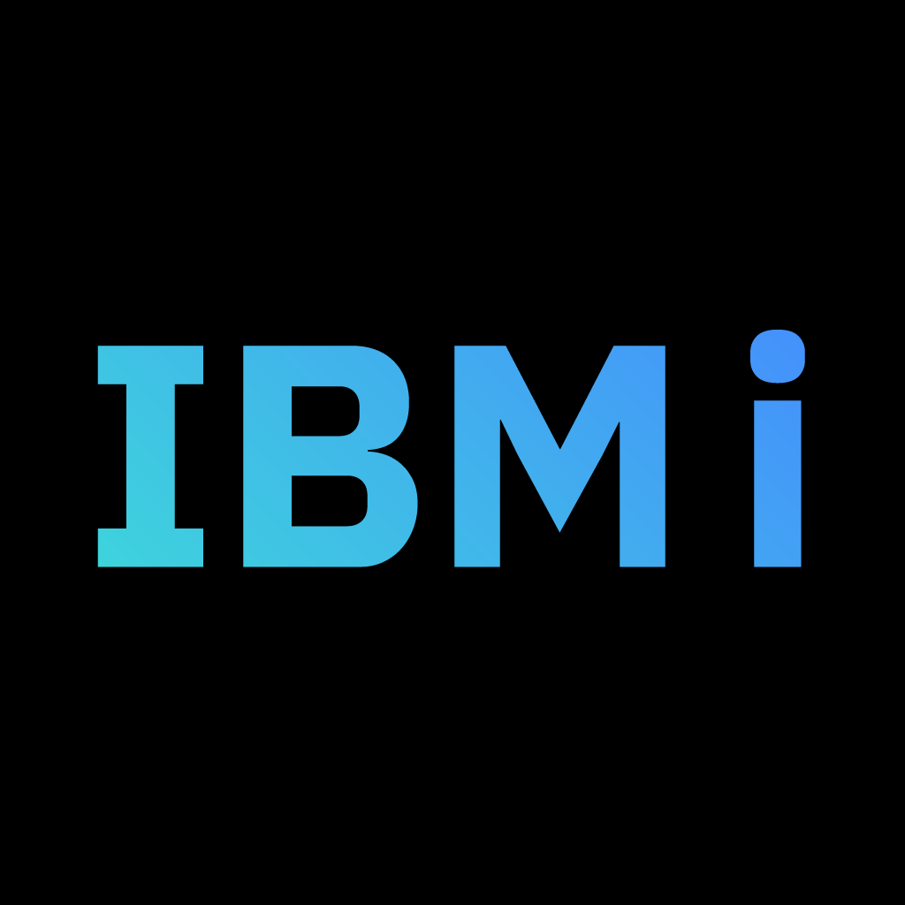

# IBM i operating system

This is intended to give a guideline on the eternal IBM i operating system.

The special term in computer science is **abstraction**. There are levels of abstraction, basically from the atom to the internet. 

Here, we are going to start from the silicon up to get a better understanding of what is going on behind the green screen.

Silicon has some nice properties to make transistors. With transistors, you make logical gates; these logical gates perform boolean operations, which turn into logical units that form a circuit, and in the middle we have the CPU, which has its corresponding architecture and instruction set architecture. 

We are familiar with the (*x86-64*)[https://en.wikipedia.org/wiki/X86-64] archs. Currently, IBM has the [*PPC64*](https://en.wikipedia.org/wiki/Ppc64) processor architecture with the [*Power ISA*](https://en.wikipedia.org/wiki/Power_ISA) instruction set architecture which is a [*RISC*](https://en.wikipedia.org/wiki/Reduced_instruction_set_computer) instruction set (yeah, RISC like [RISC-V](https://en.wikipedia.org/wiki/RISC-V])).

IBM made the first leap from the early designs of cumputers from [Harvard architecture] (https://en.wikipedia.org/wiki/Harvard_architecture) to the [Von Neuman](https://en.wikipedia.org/wiki/Von_Neumann_architecture) single-operator machine: instruction and data shared the same memory, they were fetched, decoded, and executed in a linear fashion, no branch prediction or fancy stuff. This was the [IBM 701](https://en.wikipedia.org/wiki/IBM_701). Programs were written in low-levellanguages, which made them tightly coupled to the hardware.

## Toward Higher-Level Abstraction

Due to the increase in complexity and requirements, the limitations of low-level programming became evident. That's when higher-level languages came into play (Fortran, COBOL, RPG, etc.). The compiler translated these high-level languages to machine-specific instructions. But here is the important part: *the compiled code still executed directly on the processor’s native instruction set*.

There was a need for a better way to manage resources and scale; that's when the ideas of *LSI* (virtualization of storage), *HLS* (Higher Level System), and the [Future Systems project (FS)](https://en.wikipedia.org/wiki/IBM_Future_Systems_project) started emerging. 

The main principle was to have a machine that natively executed high-level procedural languages (FORTRAN, COBOL, PL/i, APL, RPG) without interpretation. Needless to say, this was an incredibly ambitious project that needed a large number of breakthroughs in many areas, which led to the project being terminated. The seed of these ideas set a firm base for the future of IBM.

But IBM kept the grind going. They released the [System/38](https://en.wikipedia.org/wiki/IBM_System/38) which actually had some of those ambitious ideas: programs were compiled into a high-level instruction set, which was not *interpreted* but rather *translated* into a lower-level machine instruction set to be executed (big emphasis on *translated*). This system marked a revolutionary step in architecture by introducing a high-level *machine interface* (MI) and the concept of a [Technology Independent Machine Interface (TIMI)](https://en.wikipedia.org/wiki/IBM_i#TIMI).

> The operating system for the System/38 was the [Control Program Facility](https://en.wikipedia.org/wiki/Control_Program_Facility). Before that IBM had the (System Support Program)[https://en.wikipedia.org/wiki/System_Support_Program] operating system for the [System/34](https://en.wikipedia.org/wiki/IBM_System/34) and the [System/36](https://en.wikipedia.org/wiki/IBM_System/36). These were actually considered midrange computers.

The consequences of these ideas were huge: separation of high-level programming from specific instruction sets, translation of high-level instructions to low-level at compile time for no *interpretation* downtime, single-level-storage where programs, files and databases were treated as objects in the same virtual address space, and finally, a built-in relational database (DB2 Intro coming soon). No time for losers here.

>The idea of modularization and separations at different levels of abstraction is a patter found on many areas of computer science. For example: the network stack ([OSI Model](https://en.wikipedia.org/wiki/OSI_model), [TCP/IP](https://en.wikipedia.org/wiki/Internet_protocol_suite) ) and the internet ([REST arch](https://en.wikipedia.org/wiki/REST)).

## The legendary AS/400

Built on the System/38’s architecture and after refining and extending its concepts, came the famous [AS/400](https://en.wikipedia.org/wiki/IBM_AS/400). Which was one of IBM’s most successful midrange systems due to its robustness, flexibility, and backward compatibility.

> The operating system was the Integrated Operating System (OS/400)

Programs were compiled into a high-level instruction set called Intermediate Language (IL). This IL was translated into native machine code by the Licensed Internal Code (LIC), a firmware layer that handled the low-level hardware operations.

## Finally the IBM I

The AS/400 evolved into the IBM i platform. The OS/400 was renamed to i5/OS and then to the [IBM i](https://en.wikipedia.org/wiki/IBM_i)

Here starts the IBM I guideline.

## Program execution

The main purpose of an operating sytem is managing resources (CPU, Disk, Memory, etc); this includes abstracting and assigning them where needed.

To execute a program, the OS needs to allocate the resources needed for it, but it does not allocate them directly to the program; rather, an abstraction is used: [**The job**](https://en.wikipedia.org/wiki/Job_(computing)).

The system allocates resources to the job, and the program is basically **loaded** into the job resources. Now the program can be executed through the job resources. Really cool stuff.

A job can be viewed as an abstraction of allocated resources. By itself it can't do much since there is nothing to do. The same applies to a program in an inverse manner; by itself is no more than a series of instructions and data stored in disk without being used. But when the program data (instructions and data) are loaded into the corresponding job memory and the jobs resources are allocated for executing the program, then job/program execution interaction creates what is called a *process*. 

Each function call creates a stack frame with the context (variables), which will be loaded into the registers to be executed by the processor.

Till this point, the description of an operating system is mostly the same for any modern system. Now comes what is specific to the IBM i OS.

## IBM I program excecution

## Command navigation

## OPM

## ILE